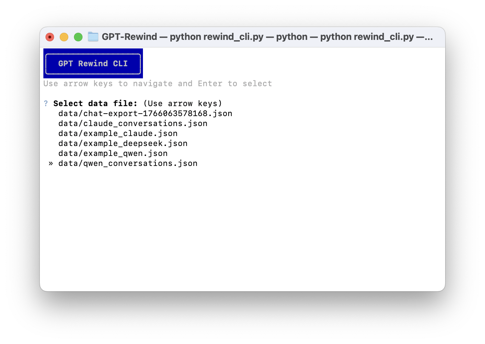
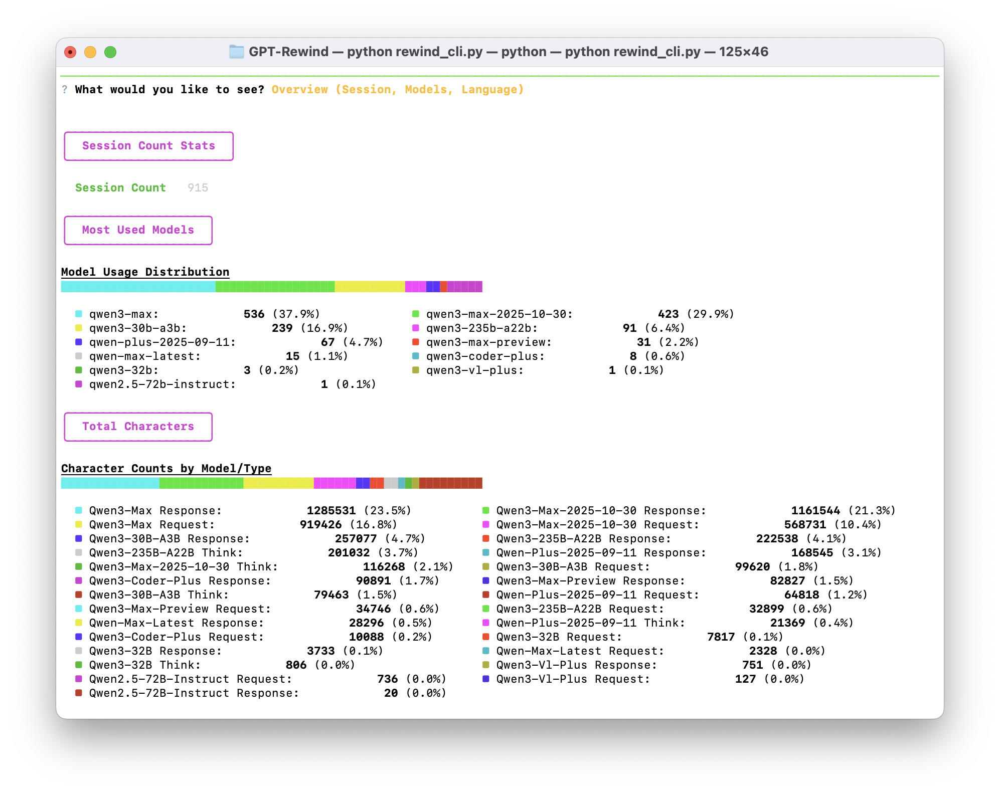
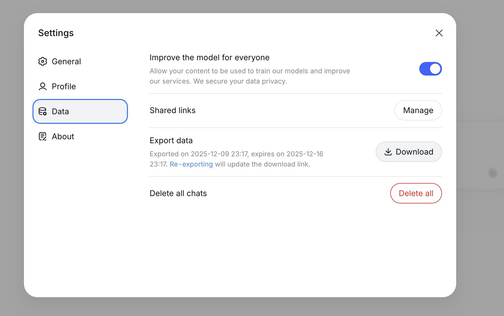
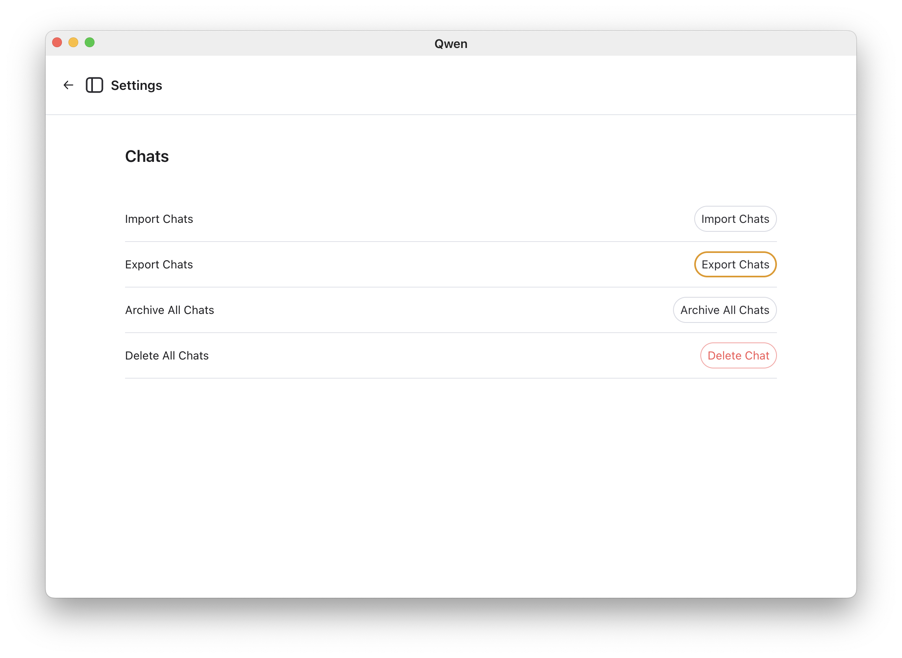
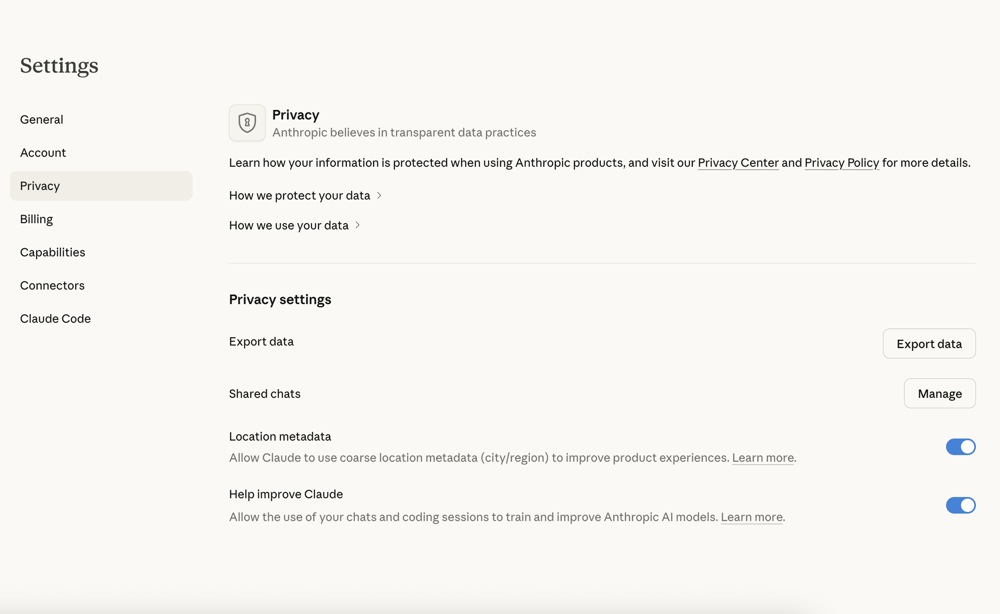

# GPT-Rewind
A simple Chatbot Annual Summary Tool

[中文版](README_ZH.md) | English


A comprehensive chat history analysis tool for AI conversations, providing insights and visualizations of your interaction patterns with AI models.

## Features

- **Annual Summary**: Get a complete overview of your AI chat history with detailed statistics
- **Visual Analytics**: Interactive charts showing usage patterns, time distributions, and language preferences
- **CLI Frontend**: A terminal-based interface with interactive menus and rich visualizations (Stacked Bar Charts)
- **Multi-Model Support**: Analyze conversations across different AI models
- **Language Detection**: Identify natural languages and programming languages used with high accuracy
- **Behavioral Insights**: Discover politeness patterns, emoji usage, and interaction styles
- **Export Functionality**: Save your annual summary as an image

## Change Log
- **2025/12/30**: Added CLI Frontend with interactive mode, stacked distribution charts, and improved language detection (Natural/Code separation) 🚀
- Fix bug in quick start on 2025/12/20 🐛 Thanks for bug report from [@Su-Zi-Zhan](https://github.com/Su-Zi-Zhan)
- Support Claude model on 2025/12/20 🎉
- Support Qwen model on 2025/12/19 🎉
- Support Windows platform on 2025/12/13 🎉 Thanks for bug report from [@zengly22](https://github.com/zengly22)

## Installation

### Prerequisites

- Python 3.7 or higher
- pip package manager

### Quick Start

1. Clone this repository:
```bash
git clone git@github.com:Pamyt/GPT-Rewind.git
cd GPT-Rewind
```

2. Run the application:
- On macOS/Linux:
```bash
bash ./start_frontend.sh
```
- On Windows:
```bash
.\start_frontend.bat
```

3. Open your browser and navigate to `http://localhost:5173`

## Usage

### CLI Usage (New!)

You can now explore your data directly from the terminal using the `rewind_cli.py` tool.

1. **Interactive Mode**:
   Simply run the script without arguments to enter the interactive menu:
   ```bash
   python3 rewind_cli.py
   ```
   

   Follow the on-screen prompts to select your data file, provider, and the type of analysis you want to see.

2. **Command Line Arguments**:
   You can also run specific commands directly:
   ```bash
   # View Overview (Models, Languages, Session Counts)
   python3 rewind_cli.py overview --file data/your_chat_history.json --provider deepseek
   ```
   

   ```bash
   # View Time Analysis (Monthly Frequency, Hourly Distribution)
   python3 rewind_cli.py time --file data/your_chat_history.json --provider deepseek
   ```
   

   ```bash
   # View Style Analysis (Emoji, Politeness)
   python3 rewind_cli.py style --file data/your_chat_history.json --provider deepseek
   ```

### Web Interface Usage

#### For DeepSeek Users

1. **Download your chat history** from the DeepSeek website:
   - Go to your DeepSeek account settings
   - Find the data export option
   - Download your conversation history as a JSON file



2. **Upload your chat history**:
   - Click the "Upload JSON Record" button
   - Select your downloaded JSON file
   - Wait for the analysis to complete

3. **Explore your insights**:
   - Navigate through different pages using the arrow keys or on-screen buttons
   - View your annual overview, AI partners, time patterns, and interaction styles
   - Export your summary as an image using the "Save Annual Memory" button

### For Qwen Users

1. **Download your chat history** from the Qwen website:
   - Go to your Qwen account settings
   - Find the data export option
   - Download your conversation history as a JSON file



2. **Upload your chat history**:
   - Click the "Upload JSON Record" button
   - Select your downloaded JSON file
   - Wait for the analysis to complete

3. **Explore your insights**:
   - Navigate through different pages using the arrow keys or on-screen buttons
   - View your annual overview, AI partners, time patterns, and interaction styles
   - Export your summary as an image using the "Save Annual Memory" button

### For Claude Users

1. **Download your chat history** from the Claude website:
   - Go to your Claude account settings
   - Find the data export option
   - Download your conversation history as a JSON file



2. **Upload your chat history**:
   - Click the "Upload JSON Record" button
   - Select your downloaded JSON file
   - Wait for the analysis to complete

3. **Explore your insights**:
   - Navigate through different pages using the arrow keys or on-screen buttons
   - View your annual overview, AI partners, time patterns, and interaction styles
   - Export your summary as an image using the "Save Annual Memory" button

## API Endpoints

The application provides the following REST API endpoints:

- `GET /` - Main web interface
- `POST /api/upload` - Upload chat history JSON file
- `POST /api/analyze` - Analyze uploaded chat data
- `GET /health` - Health check endpoint

## Project Structure

```
GPT-Rewind/
├── rewind/                 # Core analysis modules
│   ├── apis/              # API endpoints for data analysis
│   ├── data_process/      # Data processing utilities
│   └── utils/             # Helper functions
├── frontend/              # Web interface
│   ├── static/           # CSS and JavaScript files
│   └── templates/        # HTML templates
├── data/                 # Sample data
├── assets/               # Images and assets
└── tests/               # Test files
```

## Dependencies

Key dependencies include:
- Flask: Web framework
- pandas: Data processing
- plotly: Data visualization
- numpy: Numerical computing
- requests: HTTP client

For a complete list, see [`requirements.txt`](requirements.txt).


## Contributing

1. Fork the repository
2. Create a feature branch
3. Make your changes
4. Add tests if applicable
5. Submit a pull request

## License

This project is licensed under the MIT License - see the LICENSE file for details.

## Support

If you encounter any issues:
1. Check that your JSON file matches the expected format
2. Ensure all dependencies are installed correctly
3. Check the server logs for error messages
4. Create an issue on GitHub with details about your problem